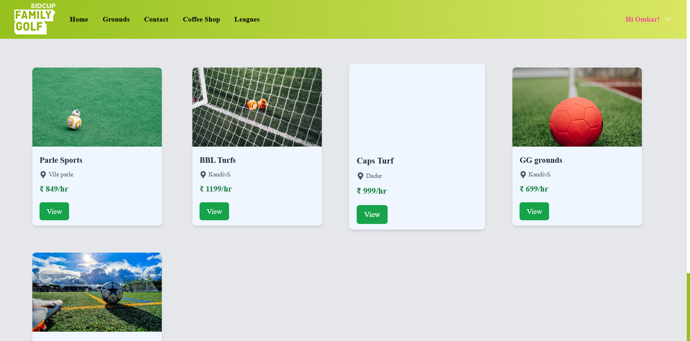
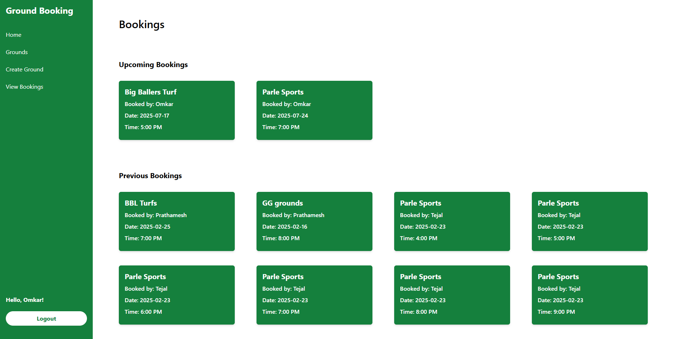

# 🏟️ Turf Booking Portal


A full-stack **MERN** (MongoDB, Express.js, React.js, Node.js) web application that allows users to browse, book, and manage turf ground reservations with ease.


A full-stack **MERN** (MongoDB, Express.js, React.js, Node.js) web application that allows users to browse, book, and manage turf ground reservations with ease. Admins have access to a dashboard to manage bookings and turf availability.

> 🌐 Live Site: [turf-booking-portal-hb1k.vercel.app](https://turf-booking-portal-hb1k.vercel.app)

---

## 📌 Features

- 🔐 User Registration & Authentication
- 📅 Turf Scheduling & Time Slot Selection
- 🧾 Booking Management for Users and Admins
- 🏟️ Turf Listing with Availability Status
- 📊 Admin Dashboard for Turf Owners

---

## 🛠️ Tech Stack

### 💻 Frontend
- React.js
- Redux
- Tailwind CSS

### 🖥 Backend
- Node.js
- Express.js
- MongoDB with Mongoose

---

## 🖼️ Project Screenshots

### 🏠 Home Page


---

### ⚽ Grounds Listing Page


---

### 📅 User Bookings Page


---

### 🔧 Admin Dashboard – Home


---

### 📋 Admin Dashboard – Bookings Overview


---

## 📁 Project Structure

```

Turf-Booking-Portal/
│
├── admin/               # Admin panel frontend
│   └── ...              # Admin-related components and pages
│
├── client/              # React frontend (user)
│   └── ...              # Components, pages, assets, etc.
│
├── server/              # Backend (Node.js + Express)
│   ├── routes/
│   ├── models/
│   ├── controllers/
│   ├── config/
│   └── server.js
│
├── .gitignore
├── .env
├── README.md
└── package.json

````

## 🔮 Future Enhancements

* 💳 Payment Gateway Integration (Stripe/Razorpay)
* 📱 PWA Support for mobile experience
* 🗺️ Map-based Turf Discovery (Google Maps API)
* 📊 Real-time Admin Analytics & Graphs
* 📩 Email/SMS Booking Confirmations

---

## 🤝 Contributing

Want to improve the project?

1. Fork the repo
2. Create a new branch: `git checkout -b feature/your-feature-name`
3. Commit your changes: `git commit -m "Add some feature"`
4. Push to the branch: `git push origin feature/your-feature-name`
5. Open a Pull Request ✅

---

## 👨‍💻 Author

**Omkar Yelve**
[GitHub Profile](https://github.com/OmkarYelve)

---

> ⭐ If you like this project, consider starring the repo !

